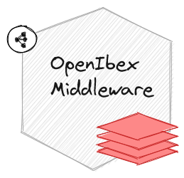
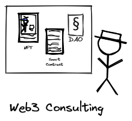

Ibex Labs is a Web3 consulting company that offers solution design and software engineering services. Our mission is to improve the adoption of Web3 technology in industries.

Ibex Labs offers OpenIbex Middleware, a flexible middleware layer for any blockchain. It provides abstractions for standards, custom modules, smart indexing, and a unified API for financial primitives. Improve your Web3 integration and efficiency with OpenIbex.

 &nbsp; 

 &nbsp;  &nbsp;  &nbsp; 

<h2 align="center">Contact</h2>

<strong>E-Mail: <a href="mailto:office@ibex.host">office at ibex.host</a></strong> 
<strong>Discord: <a href="https://discord.gg/Ceuz2FenNG">https://discord.gg/Ceuz2FenNG</a></strong> 
<strong>LinkedIn: <a href="https://www.linkedin.com/company/ibex-labs">https://www.linkedin.com/company/ibex-labs</a></strong> 
 
<strong>Address:</strong> 
Ibex Labs AG 
c/o Office Services GmbH 
Baarerstrasse 11 
6300 Zug
Switzerland

