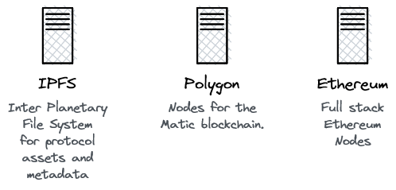

## Services - Web3 Builder
Crypto & Blockchain Consulting: Tokenomics Design, Product Owner, Strategic Advisory, Product Management, Training, Software Engineering and more.

We support your web3 project in various ways:

- Smart contract development: Economic concept, game theory, solidity development.
- Best practices for: NFT collections, token launches and DAO-communities
- Product engineering: Product-market fit, value proposition, product owner.
- Project management: Agile methodology, team sourcing.

## Projects & Customers

### Cultural Places - Oroundo Mobile GmbH
Oroundo mobile operates the platform [Culturalplaces](https://www.culturalplaces.com) that sells tour guides and tickets to cultural venues like museums. The company wants to develop the platform towards a community for people that work in the cultural industry. The "cultural people" can find funding, collaboration partners and fans in the community. 

In the first stage of the product we launched a token ($CPTC) and a "StoreFront"-application that sells tickets, redeemable vouchers, art and media files as NFTs. In the second stage the platform will evolve into a DAO-governed community that is self-managing.

Project homepage & litepaper: [Culturalplaces Metaverse](https://www.culturalplaces.com/metaverse)

### Ibex DeFi Accounting
Actionable accounting is a hard to do task for investors, businesses and user of decentralized finance alike. Ibex DeFi Accounting is a web3 application that scans your wallets and creates accounting records. So portfolio performance indicators are visible without further calculation. This includes i.e. lending protocol interest, periodic reports on staking revenue and more.

Planned Release: End of 2022.

## Opensource products
Truly decentralized web3: Crypto is opensource by design. Ibex Labs is providing a complete set of software you need to start your web3 project or company. It works with every hyperscaler and frees your project from vendor locks.

### OpenIbex Stack - Truly decentralized web3

A stack for fast web3 application development. Multi-chain, data lifecycle, intelligent caching of blockchain events, API aggregation, and many standard patterns are already implemented in OpenIbex. It only takes a few minutes to start the stack in Kubernetes, and a few more to start your own project.

OpenIbex setups start at 3 containers and can scale up into a cluster, so that OpenIbex helps you grow. The software framework of OpenIbex has three parts that can be used combined or as single blocks: Frontend, Intelligent Backend and Smartcontract Helpers.

Planned Release (Beta): November 2022

### Kubernetes Helms - For Web3 and Business
#### Crypto Helms - Bring Web3 to Kubernetes
The Ibex Crypto Helms allow us to serve our project customers with their own WebSocket gateways, IPFS and more. This further minimizes the dependence on third party gateways while not needing more time or expertise on the customers side.

Public Release (Beta): November 2022

#### Ibex Helms - Productivity for teams
The Ibex Helms are a hollistic approach on productivity software for teams. It's completely opensource. Since Web3 teams are often freelancers or fluid setups, Ibex Helms can be configured to use Microsoft, Google, GitHub and in the future also wallet logins. A truly decentralized and open solution.

## Contact Us

E-Mail: [office at ibex.host](mailto:office@ibex.host)

Address:

Ibex Labs AG

c/o Office Services GmbH

Baarerstrasse 11

6300 Zug